# National & Local Early-Signal Landscape Report

**Chronic Absenteeism in U.S. K-12 Education: National Patterns, Regional Variation, and Validation Against OUSD Student-Level Data**

*Data Sources: U.S. Department of Education EDFacts (2020-21 through 2022-23), Oakland Unified School District student-level records (2017-18 through 2023-24)*

---

## Executive Summary

Chronic absenteeism---defined as missing 10% or more of enrolled school days---affects roughly one in four U.S. students. In 2022-23, 27.8% of students nationally were chronically absent (13.4 million students), a figure that remains well above pre-pandemic baselines despite a 3-percentage-point improvement from the 2021-22 peak (30.8%). Oakland Unified School District (OUSD) faces a significantly more severe challenge: its chronic absenteeism rate reached 56.3% in 2022-23, more than double the national and California state averages, before declining to 32.1% in 2023-24.

This report identifies the early indicators that most reliably predict chronic absenteeism at both national and local levels, examines regional and demographic variation, and validates national patterns against OUSD's student-level longitudinal data.

**Key Findings:**

1. **Prior-year attendance is the single strongest early signal.** In OUSD, students with prior-year attendance below 80% have an 85.7% probability of chronic absence the following year; those above 95% have only a 16.6% probability.
2. **Socioeconomic disadvantage is the dominant demographic risk factor nationally and locally.** 67.5% of chronically absent students nationally are economically disadvantaged. In OUSD, SED students have a 39.2% chronic rate vs. 15.7% for non-SED peers.
3. **Racial disparities are substantial and consistent.** Both nationally and in OUSD, Black, Native American, and Pacific Islander students experience the highest chronic absence rates.
4. **OUSD's chronic absenteeism crisis far exceeds state and national trends**, particularly in 2022-23, suggesting local structural factors amplify national patterns.
5. **A small set of prior-year behavioral indicators---attendance rate, suspension history, and GPA---together provide strong predictive power** for identifying at-risk students before chronic absence develops.

---

## 1. National Chronic Absenteeism Landscape

### 1.1 Overall Trends (2020-21 through 2022-23)

| School Year | National Rate | Students Enrolled | Chronically Absent |
|-------------|:------------:|:-----------------:|:------------------:|
| 2020-21     | 21.1%        | 47,950,769        | 10,117,169         |
| 2021-22     | 30.8%        | 47,859,859        | 14,730,609         |
| 2022-23     | 27.8%        | 48,268,200        | 13,406,900         |

The pandemic fundamentally disrupted attendance patterns. The 2020-21 rate of 21.1% reflects a hybrid/remote learning environment where many districts used relaxed attendance accounting. The full return to in-person instruction in 2021-22 revealed the true scope of disengagement: chronic absenteeism surged to 30.8%, a 9.7 percentage-point increase. By 2022-23, a partial recovery brought the rate down by 3.0 percentage points, but the national rate remains roughly 50% higher than typical pre-pandemic levels (~15-16%).

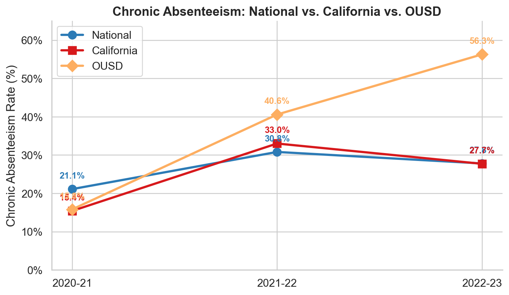
*Figure 1: Chronic absenteeism rates diverge sharply --- OUSD's post-pandemic spike far exceeds state and national trends.*

### 1.2 State-Level Variation (2022-23)

State-level chronic absenteeism rates in 2022-23 range from 16.7% (New Jersey) to 46.7% (District of Columbia), with a standard deviation of 7.2 percentage points across states.

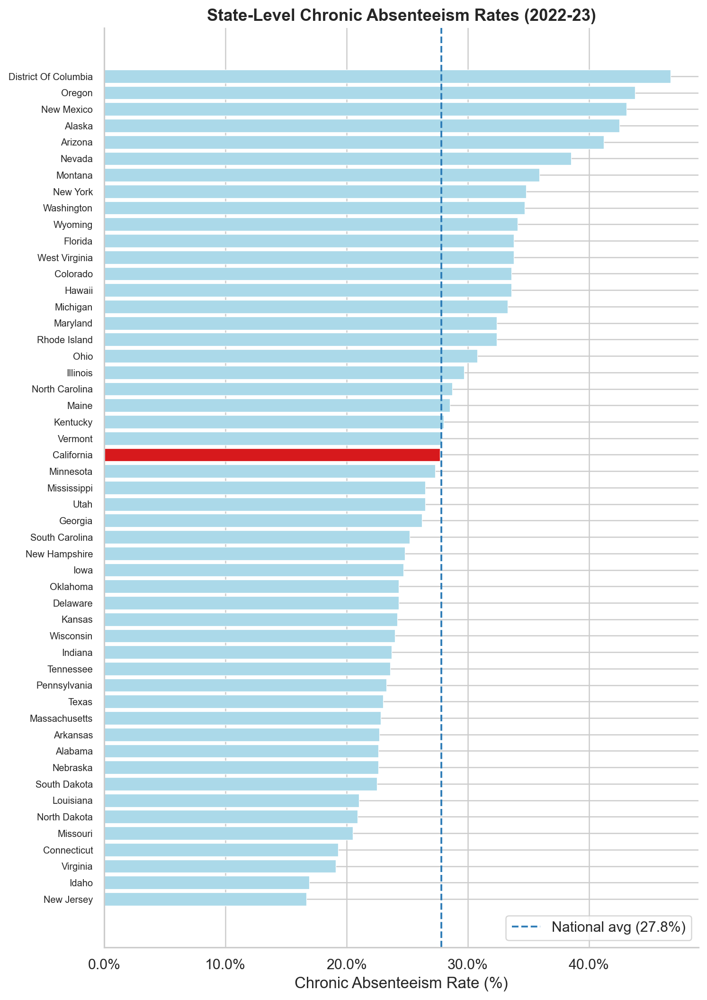
*Figure 2: All 50 states + DC ranked by chronic absenteeism rate (2022-23). California (highlighted red) sits near the national average.*

**Highest chronic absenteeism states (2022-23):**

| Rank | State                  | Rate  |
|------|------------------------|:-----:|
| 1    | District of Columbia   | 46.7% |
| 2    | Oregon                 | 43.8% |
| 3    | New Mexico             | 43.1% |
| 4    | Alaska                 | 42.5% |
| 5    | Arizona                | 41.2% |
| 6    | Nevada                 | 38.5% |
| 7    | Montana                | 35.9% |
| 8    | New York               | 34.8% |
| 9    | Washington             | 34.7% |
| 10   | Wyoming                | 34.1% |

**Lowest chronic absenteeism states (2022-23):**

| Rank | State          | Rate  |
|------|----------------|:-----:|
| 1    | New Jersey     | 16.7% |
| 2    | Idaho          | 16.9% |
| 3    | Virginia       | 19.1% |
| 4    | Connecticut    | 19.3% |
| 5    | Missouri       | 20.5% |

**California** sits near the national median at 27.7%, masking enormous within-state variation (OUSD alone is more than double the state average).

### 1.3 Regional Patterns

| Region    | Weighted Avg | Range            | Key Observations |
|-----------|:------------:|------------------|------------------|
| West      | 31.7%        | 16.9% - 43.8%   | Highest regional average; driven by OR, NM, AK, AZ |
| South     | 26.0%        | 19.1% - 46.7%   | Wide spread; DC is an outlier |
| Northeast | 26.0%        | 16.7% - 34.8%   | Lowest rates in NJ, CT; highest in NY |
| Midwest   | 27.4%        | 20.5% - 33.3%   | Most uniform; MI a notable outlier at 33.3% |

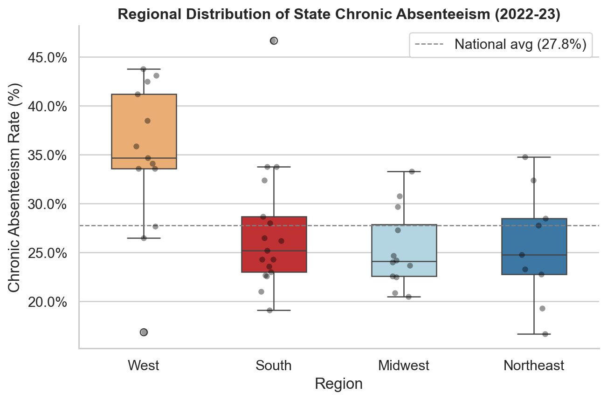
*Figure 3: The West shows both the highest median and widest spread in chronic absenteeism rates.*

Western states exhibit both the highest average and greatest variability. The clustering of high-rate states in the Mountain West and Pacific Northwest suggests shared factors: large geographic distances, rural isolation, and in some states, large Native American populations with historically underserved schools.

### 1.4 Year-Over-Year Recovery (2021-22 to 2022-23)

Of 50 states + DC, **44 improved** and only **6 worsened** between 2021-22 and 2022-23. The median state improvement was 3.1 percentage points.

**Largest improvements:**

| State          | Change  |
|----------------|:-------:|
| Vermont        | -11.7 pp |
| New Hampshire  | -9.1 pp  |
| Michigan       | -8.1 pp  |
| Rhode Island   | -6.3 pp  |
| Hawaii         | -6.1 pp  |

**Notable increase: Washington** (+16.3 pp), likely reflecting a change in attendance data reporting methodology rather than a true surge. Other increases were modest (Kentucky +1.9 pp, Louisiana +1.9 pp).

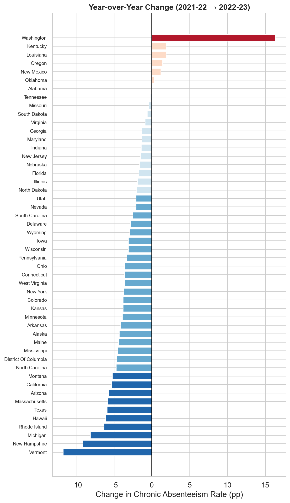
*Figure 4: Most states improved between 2021-22 and 2022-23; Washington is a notable outlier (+16.3 pp).*

---

## 2. National Early-Signal Indicators: Subgroup Analysis

### 2.1 Socioeconomic Disadvantage

Economically disadvantaged students constitute **67.5% of all chronically absent students** nationally in 2022-23 (9.06 million of 13.43 million), making economic hardship the single most prevalent risk factor. This overrepresentation is consistent across all three years of data and across all regions.

### 2.2 Race/Ethnicity Composition of Chronically Absent Students (2022-23)

| Subgroup                          | Chronically Absent | Share of Total |
|-----------------------------------|--------------------|:--------------:|
| Hispanic/Latino                   | 4,693,004          | 35.0%          |
| White                             | 4,682,312          | 34.9%          |
| Black or African American         | 2,637,251          | 19.6%          |
| Two or more races                 | 714,460            | 5.3%           |
| Asian                             | 393,110            | 2.9%           |
| American Indian/Alaska Native     | 217,020            | 1.6%           |
| Native Hawaiian/Pacific Islander  | 80,323             | 0.6%           |

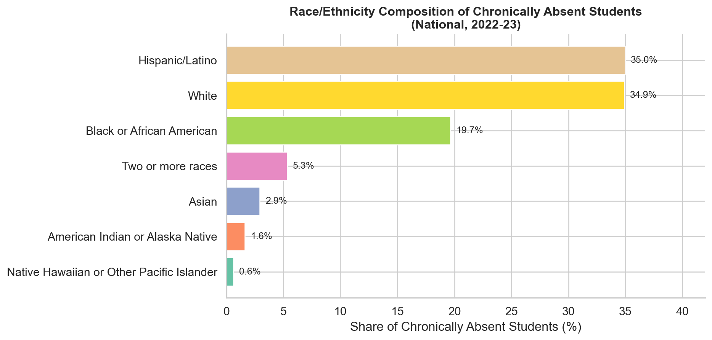
*Figure 5: Hispanic/Latino and White students make up the largest shares by raw count; Black students are overrepresented relative to enrollment.*

While White and Hispanic/Latino students compose the largest raw counts (reflecting their population share), **Black students are disproportionately represented** relative to their enrollment share (~15% of enrollment but ~20% of chronically absent students). American Indian/Alaska Native and Pacific Islander students are similarly overrepresented.

### 2.3 Disability and Special Populations

| Subgroup                                 | Chronically Absent | Share |
|------------------------------------------|:------------------:|:-----:|
| Children with disabilities (IDEA)        | 2,558,361          | 19.1% |
| English Learners                         | 1,811,778          | 13.5% |
| Homeless students                        | 687,849            | 5.1%  |
| Section 504 Disability                   | 561,818            | 4.2%  |

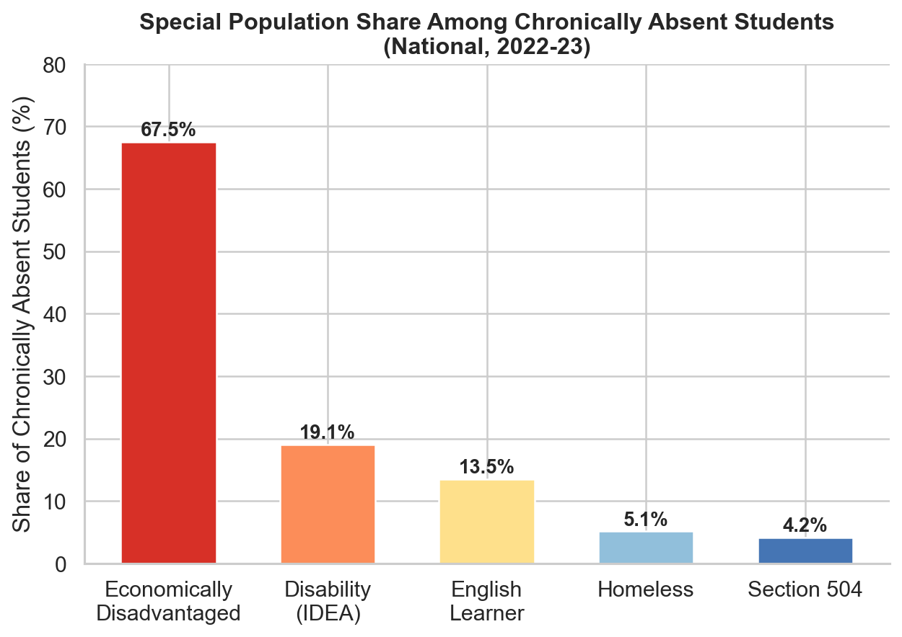
*Figure 6: Economically disadvantaged students dominate the chronically absent population at 67.5%.*

Students with disabilities (IDEA) account for nearly one in five chronically absent students---substantially above their ~14% share of total enrollment. Homeless students, while a small share of total enrollment (~2-3%), represent 5.1% of the chronically absent population, indicating roughly double the expected rate.

### 2.4 Temporal Stability of Subgroup Patterns

Comparing composition across years reveals striking stability:

| Subgroup                | 2020-21 | 2021-22 | 2022-23 |
|-------------------------|:-------:|:-------:|:-------:|
| Black or African American | 23.0%  | 19.7%   | 19.6%   |
| Hispanic/Latino          | 33.5%  | 35.2%   | 35.0%   |
| White                    | 34.6%  | 35.4%   | 34.9%   |
| English Learner          | 12.7%  | 12.9%   | 13.5%   |
| Homeless                 | 4.5%   | 4.3%    | 5.1%    |

The slight decline in Black student share from 2020-21 (23.0%) to 2022-23 (19.6%) coincides with the broader post-pandemic normalization---suggesting that early pandemic disruptions may have disproportionately impacted Black student attendance. The slight rise in homeless student share (4.5% to 5.1%) may reflect worsening housing instability post-pandemic.

---

## 3. OUSD Local Data: Validating National Patterns

### 3.1 OUSD Chronic Absenteeism Trends

| School Year | OUSD Rate | California | National | OUSD vs. National |
|-------------|:---------:|:----------:|:--------:|:-----------------:|
| 2017-18     | 11.7%     | ---        | ---      | ---               |
| 2018-19     | 28.2%     | ---        | ---      | ---               |
| 2019-20     | 14.4%     | ---        | ---      | ---               |
| 2020-21     | 15.8%     | 15.4%      | 21.1%    | -5.3 pp           |
| 2021-22     | 40.6%     | 33.0%      | 30.8%    | +9.8 pp           |
| 2022-23     | 56.3%     | 27.7%      | 27.8%    | **+28.5 pp**      |
| 2023-24     | 32.1%     | ---        | ---      | ---               |

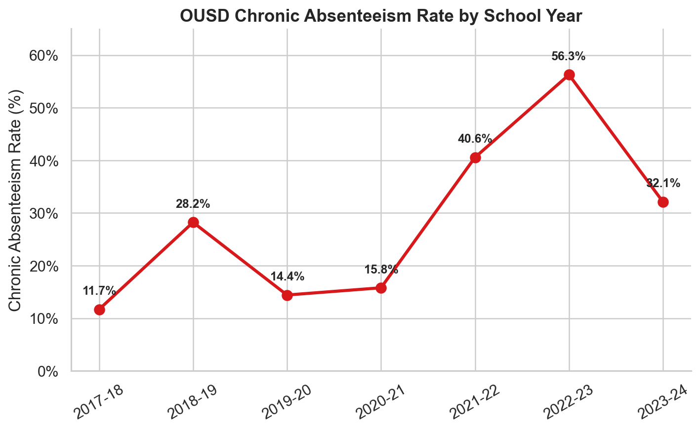
*Figure 7: OUSD chronic absenteeism across seven school years, peaking at 56.3% in 2022-23 before recovering.*

OUSD tracked close to state and national benchmarks in 2020-21, but **diverged dramatically** in subsequent years. In 2022-23, OUSD's chronic rate (56.3%) was more than double the California average (27.7%). The sharp recovery to 32.1% in 2023-24 suggests that some of the spike was driven by transient factors (e.g., data reporting, enrollment churn, or targeted interventions taking effect).

**Implication:** National patterns provide a baseline, but OUSD's trajectory underscores that local and district-level factors---school climate, neighborhood safety, housing instability, community health---can amplify or attenuate national trends by 20+ percentage points.

### 3.2 Demographic Risk Factors in OUSD

#### Race/Ethnicity

| Ethnicity              | OUSD Chronic Rate | n       | National Signal Validated? |
|------------------------|:-----------------:|--------:|:-------------------------:|
| Pacific Islander       | 55.1%             | 1,393   | Yes --- highest risk group |
| African American       | 43.5%             | 30,611  | Yes --- strongly overrepresented |
| Native American        | 40.4%             | 361     | Yes --- small n but high risk |
| Latino                 | 34.9%             | 71,093  | Yes --- largest group, above average |
| Not Reported           | 34.3%             | 3,454   | ---                       |
| Multiple Ethnicity     | 23.3%             | 9,485   | Partially |
| Filipino               | 23.3%             | 878     | ---                       |
| White                  | 17.5%             | 16,364  | Yes --- below average |
| Asian                  | 16.3%             | 15,793  | Yes --- lowest risk |

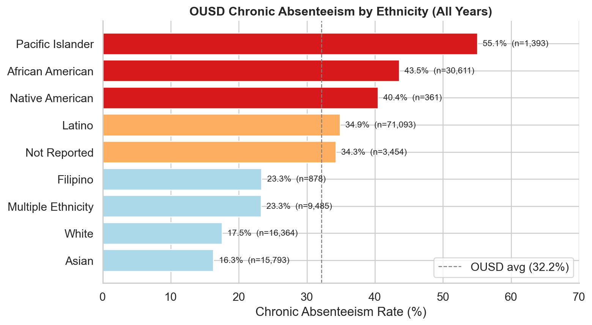
*Figure 8: Pacific Islander, African American, and Native American students face the highest chronic absence rates in OUSD.*

**Validation:** OUSD data strongly confirm the national pattern. Black, Native American, and Pacific Islander students face the highest chronic absence risk at both levels. The OUSD-specific finding is the particularly elevated rate for Pacific Islander students (55.1%), consistent with known barriers facing this community in the Bay Area.

#### Socioeconomic Status

| SED Status  | Chronic Rate | n       |
|-------------|:------------:|--------:|
| SED         | 39.2%        | 95,534  |
| Not SED     | 15.7%        | 27,635  |
| Unknown     | 23.9%        | 26,263  |

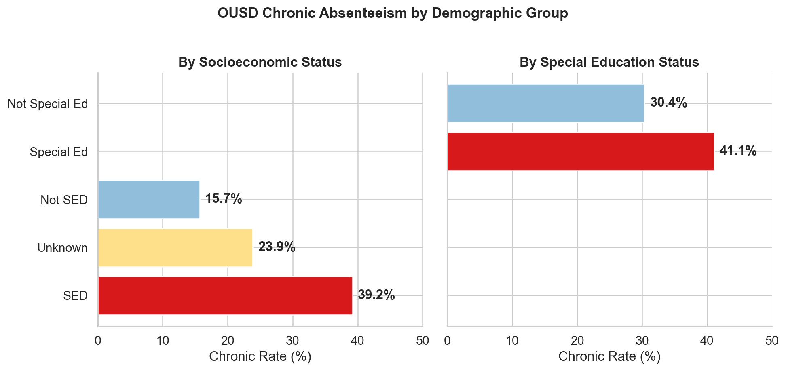
*Figure 9: SED students are 2.5x more likely to be chronically absent; Special Ed students 35% more likely.*

The 2.5x chronic rate differential between SED and non-SED students mirrors the national pattern where 67.5% of chronically absent students are economically disadvantaged. **This is the strongest demographic predictor in both datasets.**

#### Special Education

| SpEd Status     | Chronic Rate | n       |
|-----------------|:------------:|--------:|
| Special Ed      | 41.1%        | 24,700  |
| Not Special Ed  | 30.4%        | 124,732 |

Students with disabilities in OUSD are 35% more likely to be chronically absent, consistent with the national overrepresentation (19.1% of chronic absentees vs. ~14% of enrollment).

#### English Fluency

| Fluency Status | Chronic Rate | n       |
|----------------|:------------:|--------:|
| EL (English Learner)  | 33.7% | 53,345  |
| EO (English Only)     | 34.0% | 73,418  |
| RFEP (Reclassified)   | 23.0% | 18,179  |
| IFEP (Initially Fluent) | 19.2% | 4,342 |

Notably, in OUSD, English Learners and English-Only students have **nearly identical** chronic rates (~34%), while reclassified and initially fluent students are substantially lower (~20-23%). This suggests that EL status per se is not the risk factor; rather, it correlates with socioeconomic conditions. Students who have been reclassified (RFEP) show strong attendance, possibly reflecting academic engagement and family stability.

### 3.3 Grade-Level Patterns

| Grade Level | Chronic Rate | Pattern |
|-------------|:------------:|---------|
| Pre-K (-1)  | 42.7%        | High --- youngest children vulnerable |
| K           | 34.0%        | Transition year risk |
| 1-5         | 26.4%-29.7%  | **Lowest rates** --- elementary stability |
| 6-8         | 28.1%-33.3%  | Rising with middle school transition |
| 9           | 38.8%        | **Sharp increase** at high school entry |
| 10          | 45.1%        | Continued escalation |
| 11          | 48.3%        | Peak risk period |
| 12          | 54.0%        | **Highest rate** --- disengagement/early exit |

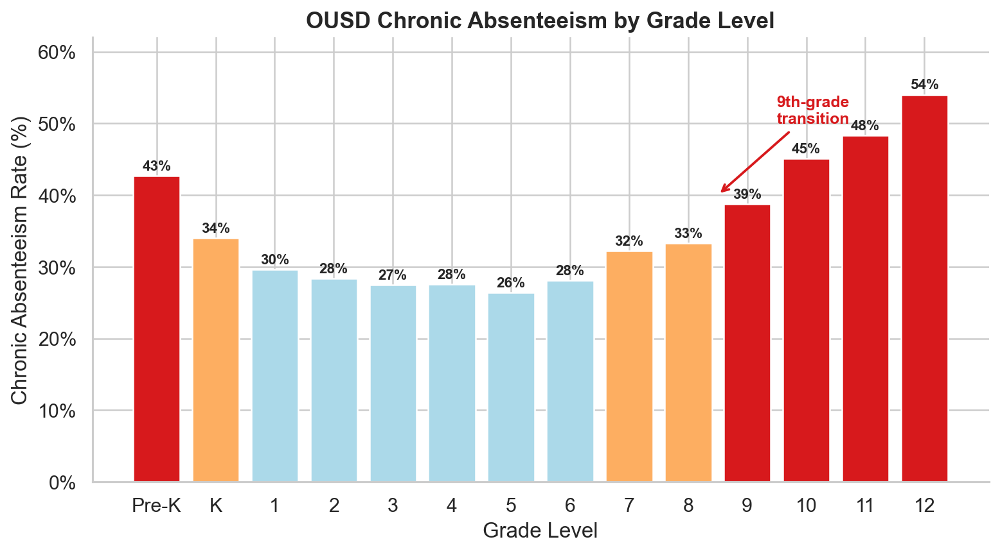
*Figure 10: U-shaped curve --- rates trough in elementary grades, then escalate steeply through high school.*

The grade-level curve reveals a consistent U-shape: elevated rates in early childhood (Pre-K/K), a trough in elementary grades, and a steep escalation through high school. **The 9th-grade transition is a critical inflection point**, with a 5.5 percentage-point jump from 8th grade. By 12th grade, more than half of OUSD students are chronically absent.

**Implication for early signals:** Monitoring the 8th-to-9th grade transition and intervening during the summer before high school entry could prevent a substantial portion of high school chronic absenteeism.

---

## 4. Early-Signal Validation: Behavioral Indicators in OUSD

### 4.1 Prior-Year Attendance Rate (Strongest Single Predictor)

| Prior-Year Attendance | Current-Year Chronic Rate | n       | Risk Level |
|-----------------------|:-------------------------:|--------:|:----------:|
| < 80%                 | **85.7%**                 | 12,214  | Critical   |
| 80-85%                | 61.9%                     | 8,419   | Very High  |
| 85-90%                | 39.1%                     | 17,251  | High       |
| 90-95%                | 21.6%                     | 33,710  | Moderate   |
| 95-100%               | 16.6%                     | 41,473  | Low        |

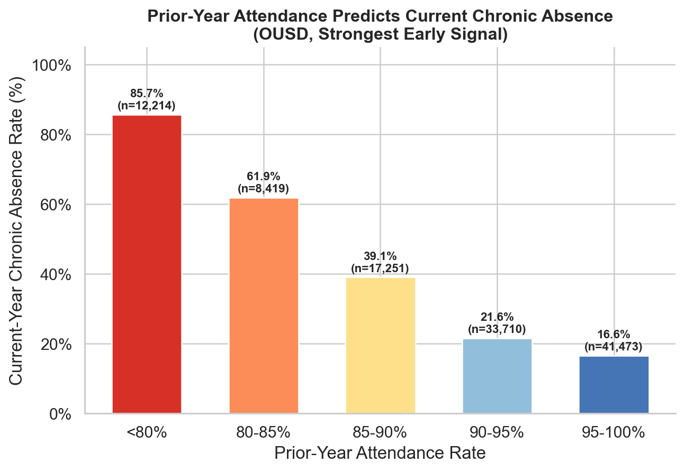
*Figure 11: The strongest early signal --- prior-year attendance below 80% predicts 85.7% chronic absence rate.*

This is the clearest early signal in the data. There is a **near-linear dose-response relationship** between prior-year attendance and future chronic absenteeism. Students with attendance below 80% in the prior year have more than 5x the chronic absence risk of students above 95%.

### 4.2 Prior-Year Chronic Status (Persistence Effect)

| Prior-Year Status     | Current Chronic Rate | n       |
|-----------------------|:--------------------:|--------:|
| Was chronically absent | **60.3%**           | 36,221  |
| Was not chronic        | 19.2%               | 76,860  |

Chronic absenteeism is highly persistent: **60.3% of previously chronic students remain chronic** the following year, compared to only 19.2% of non-chronic students. However, 39.7% of previously chronic students do recover, indicating that the condition is not deterministic and that intervention can make a difference.

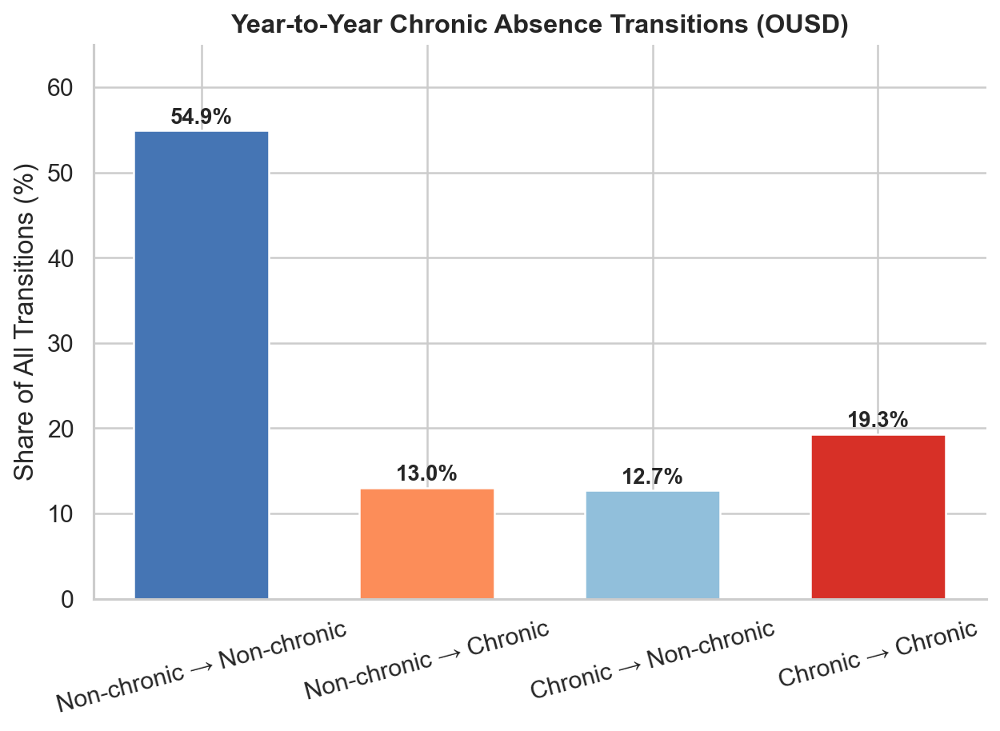
*Figure 12: 55% of student-year transitions are stable non-chronic; 19.3% are persistently chronic.*

The transition matrix (n=113,081 student-year transitions):
- **55.0%** were non-chronic both years (stable attenders)
- **19.3%** were chronic both years (persistent absentees)
- **13.0%** transitioned from non-chronic to chronic (new cases)
- **12.7%** recovered from chronic to non-chronic (successful recovery)

### 4.3 Prior-Year Suspension History

| Prior Suspension | Current Chronic Rate |
|------------------|:--------------------:|
| Had suspension   | **58.3%**            |
| No suspension    | 31.8%                |

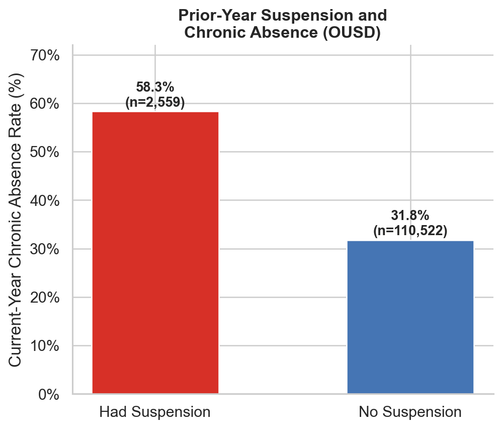
*Figure 13: Students with any prior-year suspension face nearly double the chronic absence risk.*

Students with any prior-year suspension are nearly **twice as likely** to become chronically absent. Suspensions serve as both a direct cause (missed days) and a signal of disengagement, behavioral challenges, or school-climate issues.

### 4.4 Prior-Year GPA

| Prior GPA Range | Current Chronic Rate | n       |
|-----------------|:--------------------:|--------:|
| 0-1.0           | **77.2%**            | 1,939   |
| 1.0-2.0         | 61.8%               | 4,478   |
| 2.0-3.0         | 45.6%               | 8,778   |
| 3.0-4.0         | 24.7%               | 15,623  |
| 4.0+            | 18.4%               | 521     |

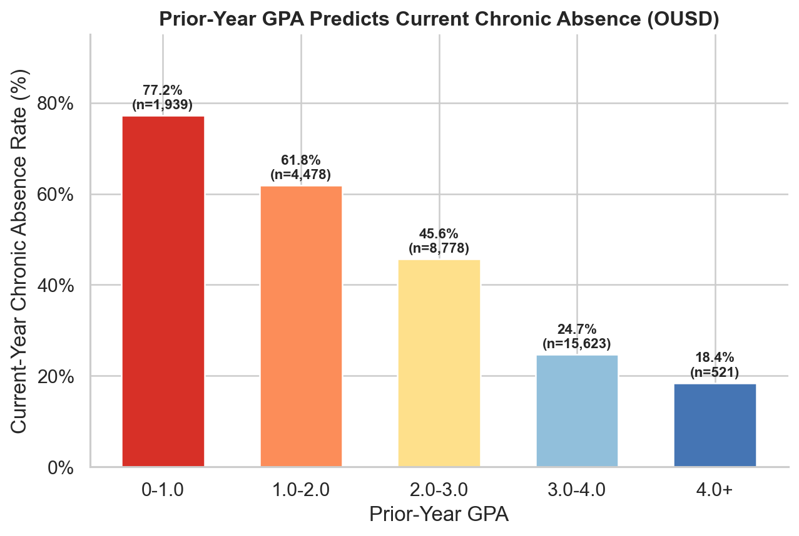
*Figure 14: GPA below 1.0 is associated with a 77.2% chronic absence rate --- a strong inverse relationship.*

Academic performance shows a strong inverse relationship with chronic absence. Students with GPAs below 1.0 have a 77.2% chronic absence rate---the highest of any behavioral indicator analyzed. This likely reflects a feedback loop: poor attendance leads to poor grades, which reduces school engagement, further increasing absenteeism.

### 4.5 Neighborhood-Level Indicators

| Neighborhood Factor          | Correlation | Chronic Mean | Non-Chronic Mean |
|-----------------------------|:-----------:|:------------:|:----------------:|
| Violent crimes (by ZIP)      | +0.091      | 1,053        | 860              |
| Total crimes (by ZIP)        | +0.068      | 4,211        | 3,695            |
| Median household income      | -0.038      | $85,151      | $88,307          |
| Poverty rate (%)             | +0.008      | 14.9%        | 14.7%            |
| Unemployment rate (%)        | -0.000      | 6.3%         | 6.3%             |

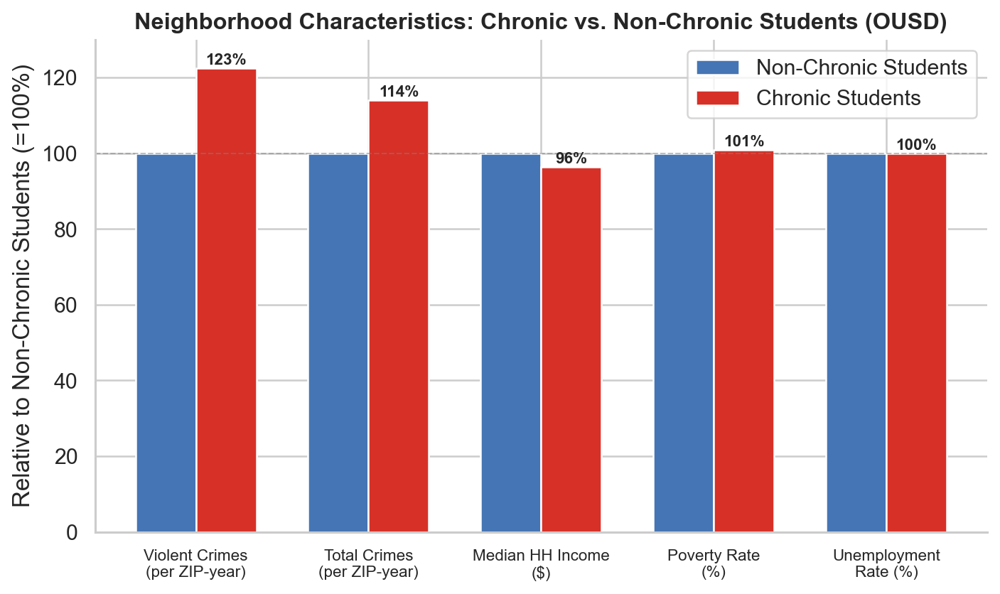
*Figure 15: Chronically absent students live in neighborhoods with ~22% more violent crime and ~14% more total crime.*

Neighborhood-level factors show **weak but directionally consistent** correlations. Violent crime exposure has the strongest neighborhood signal (+0.091), with chronically absent students living in ZIP codes averaging 22% more violent crimes. The relatively weak correlations likely reflect that within Oakland, neighborhood variation is modest compared to individual and family-level factors. These indicators would likely show stronger effects in a dataset spanning multiple cities or regions.

---

## 5. Synthesis: How National Patterns Manifest in OUSD

### 5.1 Patterns That Validate Nationally

| National Signal | OUSD Validation | Strength |
|----------------|-----------------|:--------:|
| Economic disadvantage as top risk factor | SED students 2.5x more likely chronic | Strong |
| Black/Native American/Pacific Islander overrepresentation | Confirmed; Pacific Islander highest at 55.1% | Strong |
| Disability status increases risk | SpEd +35% relative risk | Moderate |
| High school grades show highest rates | Grade 12 at 54.0%; steady escalation from grade 9 | Strong |
| Post-pandemic spike and partial recovery | Confirmed, but OUSD spike far more severe | Strong |

### 5.2 OUSD-Specific Amplifying Factors

Several factors explain why OUSD chronic absenteeism exceeds national and state averages by such a wide margin:

1. **Demographic composition:** OUSD serves a predominantly low-income, majority-minority population. Given that SED status and certain racial/ethnic backgrounds are the strongest demographic risk factors nationally, OUSD's student body has a higher baseline risk profile than the average U.S. district.

2. **Urban concentration effects:** High neighborhood crime (22% more violent crimes in ZIP codes of chronically absent students), housing instability, and transportation barriers concentrate in urban districts.

3. **High school disengagement cascade:** OUSD's grade-level data shows a steeper escalation curve than national averages suggest, with chronic rates exceeding 50% by grade 12. This may reflect weaker high school safety nets or more severe credit-recovery barriers.

4. **Pandemic recovery lag:** While most states improved by 3+ percentage points between 2021-22 and 2022-23, OUSD's rate actually increased from 40.6% to 56.3% before sharply declining to 32.1% in 2023-24. This lagged recovery pattern may reflect deeper community disruption or a delayed reporting/data alignment issue.

### 5.3 Factors That Differ from National Patterns

- **English Learner status** is not an independent risk factor in OUSD (EL and EO students have identical chronic rates), despite EL students being overrepresented in national chronic absence counts. This suggests the national EL effect is driven by correlated socioeconomic factors rather than language barriers per se.
- **Gender** shows virtually no differential in OUSD (F: 32.3%, M: 32.0%), consistent with the national data where gender differences are minimal compared to other factors.

---

## 6. Recommended Early-Warning Framework

Based on the convergence of national and OUSD evidence, we recommend a tiered early-warning system using the following indicators, ranked by predictive strength:

### Tier 1: Strongest Signals (individual-level, prior-year)

| Indicator | Threshold | Action Trigger |
|-----------|-----------|----------------|
| Prior-year attendance rate | < 90% | Flag for intervention |
| Prior-year attendance rate | < 85% | Intensive case management |
| Prior-year chronic status | Was chronic | Automatic enrollment in support program |
| Prior-year GPA | < 2.0 | Combined academic + attendance support |

### Tier 2: Amplifying Risk Factors (demographic/structural)

| Indicator | Risk Factor |
|-----------|-------------|
| SED status | 2.5x baseline risk |
| Grade transition (8th → 9th) | 5.5 pp spike in chronic rate |
| Special education status | 35% elevated risk |
| Race/ethnicity (Pacific Islander, Black, Native American) | 1.3-1.7x baseline risk |
| Prior suspension | 1.8x baseline risk |

### Tier 3: Contextual Signals (neighborhood-level)

| Indicator | Signal |
|-----------|--------|
| ZIP-level violent crime | +22% in chronic-absent student neighborhoods |
| ZIP-level median income | ~$3,100 lower in chronic-absent neighborhoods |
| ZIP-level poverty rate | Weak but directionally consistent |

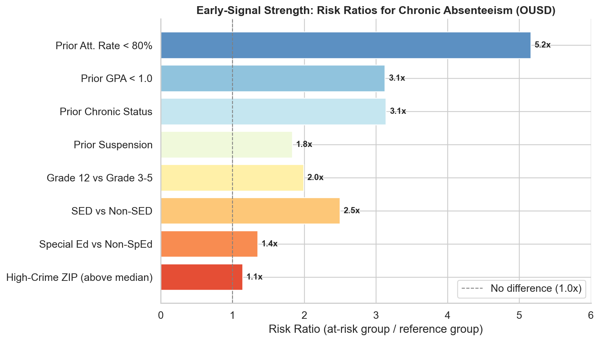
*Figure 16: Risk ratios across all early-signal indicators --- prior-year attendance below 80% carries the highest risk multiplier (5.2x).*

**Implementation note:** Tier 1 indicators alone identify the majority of future chronic absentees. Tier 2 factors help prioritize limited intervention resources. Tier 3 factors are most useful for system-level resource allocation (e.g., targeting school sites in high-crime neighborhoods for additional support staff).

---

## 7. Limitations

1. **National data granularity:** The EDFacts data provides only state-level aggregate counts and percentages. We cannot compute subgroup-specific chronic rates (e.g., the rate among Black students nationally) because total enrollment by subgroup is not available in the counts file. The composition analysis (share of chronically absent population) is informative but not directly comparable to OUSD's individual-level rate analysis.

2. **Temporal mismatch:** National data covers 2020-21 through 2022-23; OUSD data extends to 2023-24. Pre-pandemic national baselines are not available in this dataset, limiting trend analysis.

3. **OUSD 2022-23 anomaly:** The 56.3% chronic rate is exceptionally high and warrants investigation into whether data collection or enrollment counting methods changed that year. The sharp recovery in 2023-24 (32.1%) supports this possibility.

4. **Neighborhood data coverage:** External data (crime, Census) covers only Oakland ZIP codes (~57.5% of student-years), limiting the neighborhood analysis to a subset of the data.

5. **Causal inference:** All analyses are correlational. Prior-year attendance predicts future chronic absence but may not be the causal mechanism---both may be driven by underlying factors (family instability, health conditions, housing insecurity) not captured in the data.

---

## 8. Conclusion

Chronic absenteeism is a nationwide crisis that disproportionately affects economically disadvantaged students, students of color, students with disabilities, and students in the Western United States. OUSD exemplifies how these national risk factors concentrate in urban districts serving high-need populations, producing chronic absenteeism rates that are 2x the national average.

The most actionable finding is the extraordinary predictive power of **prior-year attendance**: a student whose attendance fell below 80% last year has an 85.7% probability of chronic absence this year. This simple, universally available metric---combined with SED status, grade level, and suspension history---can identify the vast majority of at-risk students before the school year begins.

The convergence of national and local evidence points to a clear strategy: **intervene early, intervene on attendance itself, and concentrate resources on the transition to high school and on students with compounding risk factors.** National patterns set the baseline; district-level data like OUSD's reveals where and how intensely those patterns manifest in specific communities.
